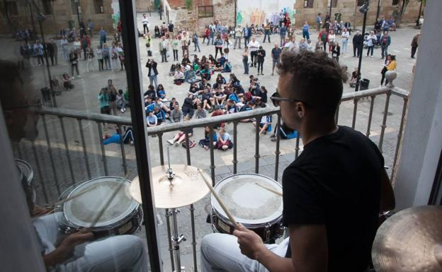

# LA MÚSICA EN TIEMPOS DE PANDEMIA
La pandemia global producida por la [COVID-19](https://espanol.cdc.gov/coronavirus/2019-ncov/symptoms-testing/symptoms.html) **ha cambiado radicalmente nuestras vidas**. Son muchos los sectores que se han visto afectados y han tenido que adaptarse a esta “Nueva Normalidad” de la que tanto se habla en la actualidad.
El sector musical es uno de los que más ha sufrido esta pandemia y todas sus consecuencias, desde las enseñanzas musicales hasta los artistas y grupos, pasando por las tiendas de música. Todos ellos han tenido que buscar nuevas **formas, medidas, protocolos,** así como nuevos **productos y artículos** para ayudar a prevenir los contagios y seguir adelante.
## La música durante el confinamiento

`Iniciativa de muchos músicos que ante la situación del sector,
decidieron compartir música desde sus balcones`

En marzo nuestro país se paralizó por completo en un **confinamiento domiciliario** a nivel nacional, para intentar combatir el rápido avance del coronavirus. 
En consecuencia a todo esto, el sector de la música, al igual que muchos otros, se vió gravemente afectado. Clases, conciertos, actuaciones, todo quedó cancelado, al tiempo que las tiendas de música e instrumentos, al igual que muchos otros negocios tuvieron que cerrar.
Por delante, largos meses de encierro y distanciamiento social que, si bien fueron muy **difíciles y duros** para tod@s, también trajeron **cosas positivas**.
Y es que durante todo este tiempo **la música nunca dejó de sonar**, al contrario, se multiplicó en nuestros hogares y nuestros balcones, aportando esa **alegría y esperanza** que tanto necesitábamos en esos momentos. Nos ayudó a relajarnos, nos hizo soñar y viajar cuando no se podía e incluso nos ayudó a reconectar con nosotros mismos.
Y es que **la música** tiene esa capacidad para recuperar recuerdos del pasado, aportando **familiaridad, tranquilidad y consuelo** frente a un futuro incierto.
Fueron muchas las **iniciativas y proyectos musicales** que surgieron durante todo ese tiempo. Desde músicos y artistas que realizaban **conciertos** para sus vecinos, hasta **festivales y actuaciones** en las redes sociales, pasando por la creación de nuevas **canciones e himnos**, que nos permitían conectarnos unos con otros a pesar de la distancia y evadirnos de la dura realidad del momento.
##Medidas de prevención en la música frente al Covid
Con la **desescalada** tras el confinamiento llegaron las **normas, protocolos y medidas de prevención**, convirtiéndose en una parte muy importante de la *“Nueva Normalidad”*.
También en la música empezaron a realizarse y adaptarse todas estas medidas. Escuelas de música, conservatorios, bandas y orquestas tuvieron que adaptar sus formas de trabajar, enseñar y aprender.
A las **medidas de protección** más generales como:
- Uso obligatorio de mascarilla
- Distancia social de 1,5m
- Ventilación frecuente
- Lavado y desinfección de manos

También se sumaron otras **más específicas** dirigidas sobre todo a las **actividades musicales** donde se utiliza un **instrumento**, sobre todo aquellos de viento.  Y es que en los pabellones de los instrumentos se produce una condensación debido a la espiración, que puede aumentar la probabilidad de propagación del virus. Algunas de estas medidas:
1. Limpieza y desinfección de los instrumentos.
2. No compartir los instrumentos.
3. Evitar dejar el agua producida por la condensación en el suelo.
4. No soplar de manera enérgica para limpiar el instrumento.
5. Limpieza de instrumentos de viento en habitaciones separadas.
6. Uso de barreras físicas (mamparas o pantallas protectoras)

<table>
    <tr>
      <td>Foo</td>
    </tr>
</table>

Esta pandemia nos está cambiando para siempre, pero esperamos que sea un **cambio hacia mejor** y sobre todo que nos haya servido para darnos cuenta que la **música y la cultura** en general, son un **elemento indispensable** en nuestras vidas y que debemos cuidarlas y protegerlas, a ella y a todas aquellas personas que trabajan y viven por y para ella.
> **"La música es para el alma lo que la gimnasia para el cuerpo"** - Platón (427-347 a. C.) Filósofo griego
